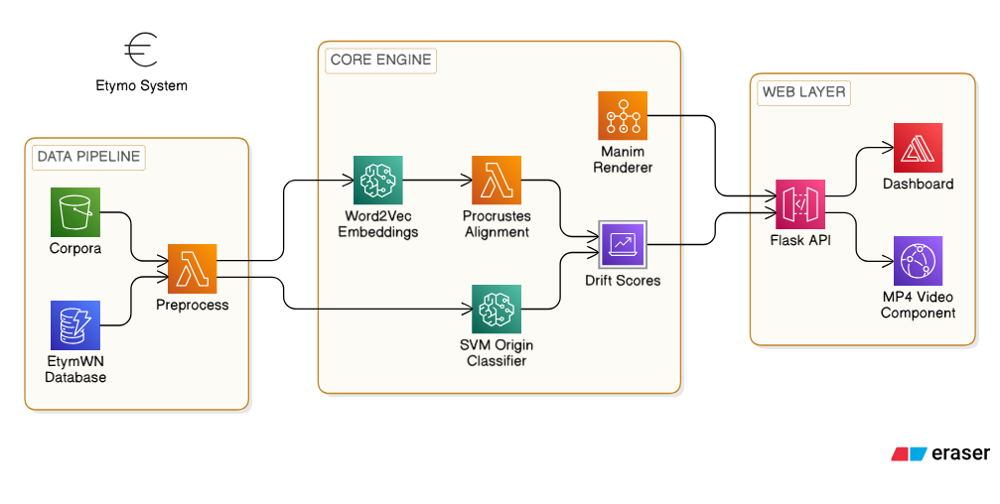

# Etymo: Etymology-Aware Semantic Shift Analysis 🏛️📈

**Etymo** is an advanced Natural Language Processing (NLP) system and full-stack web application designed to quantitatively measure how word meanings change over time (semantic drift), and statistically determine if ancient linguistic roots (like Proto-Indo-European or Germanic) are more resistant to meaning-change than modern borrowed words.



## ✨ Core Features
- **Diachronic Word Embeddings:** Independently trained Word2Vec models mapping 19th-century and 21st-century text corpora.
- **Orthogonal Procrustes Alignment:** Advanced linear algebra to mathematically rotate and align the differing century vector spaces.
- **Machine Learning Predictor:** A Support Vector Machine (LinearSVC) utilizing character-level TF-IDF n-grams to guess the historical origin of any English word without needing a dictionary.
- **Mathematical Manim Animations:** Procedurally generated geometry animations rendering the Procrustes rotations using exactly the math calculated.
- **Bespoke Flask Dashboard:** A deeply customized, responsive GUI built completely on CSS Grids to map data visually without frontend bloat.

## 🚀 Quick Start (Docker)
The easiest way to run the application is via Docker.
```bash
# Clone the repository
git clone https://github.com/Aahrav/ETYMO.git
cd ETYMO

# Build and run the containers
docker-compose up --build
```
Access the dashboard at `http://localhost:5000`.

## 💻 Manual Installation
```bash
# Create and activate virtual environment
python -m venv venv
source venv/bin/activate  # Windows: venv\Scripts\activate

# Install dependencies
pip install -r requirements.txt

# Run the backend
python web/app.py
```

## 🎥 Demonstration Video
*(If you have a screen recording of the dynamic dashboard or Manim animations, please upload `demo.mp4` to your repository and uncomment the line below to embed it natively in GitHub)*
<!-- <video src="media/demo.mp4" controls="controls" muted="muted" playsinline="playsinline" width="100%"></video> -->

## 🔬 Methodology Pipeline
1. **EtymWN Preprocessing:** Scrubbed the Etymological WordNet into 6 core classes (`Germanic`, `Latin`, `Greek`, `Sanskrit`, `PIE`, `Other`).
2. **Classifier Training:** Feature extraction via character n-grams. SVM cross-validated at ~91% macro F1.
3. **Embeddings Engine:** Trained CBOW / Skip-Gram diachronically. 
4. **Semantic Drift:** Measured mathematically via `1 - cosine_similarity(OldVec, NewVec)` after orthogonal rotation.
5. **Statistical Testing:** Applied Kruskal-Wallis H-test on drift scores, discovering PIE roots form the most stable semantic cluster.

## 🗂️ Directory Structure
```text
ETYMO/
├── REPORT_PNGS/         # Architectural and Data Flow Diagrams
├── data/                # Etymology datasets and origin subsets
├── src/                 # ML and NLP Source code
├── web/                 # Flask Backend & Dashboard UI
├── manim_scenes/        # Python animation scripts for mathematical visuals
├── results/             # Saved Word2Vec models, aligned spaces, and videos
├── DOCKER.md            # Detailed Docker run instructions
└── requirements.txt     # Python dependencies
```

## 📜 License
Academic project — all rights reserved.
